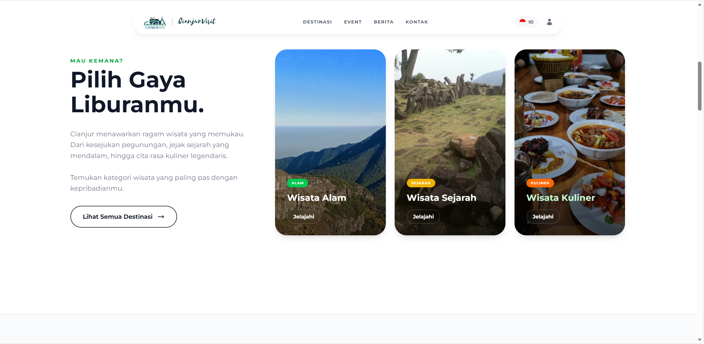
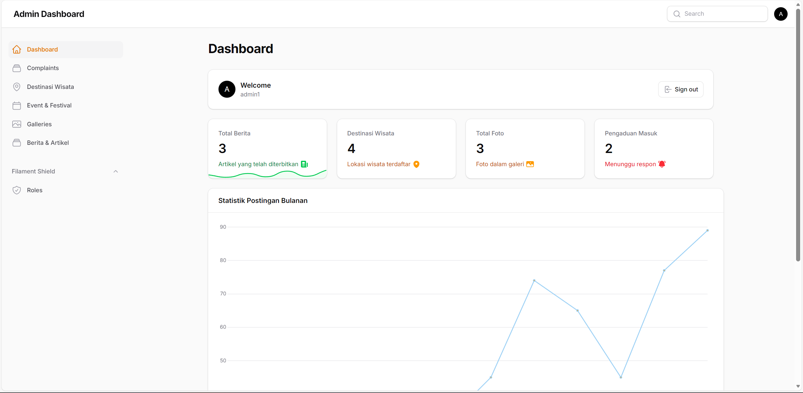
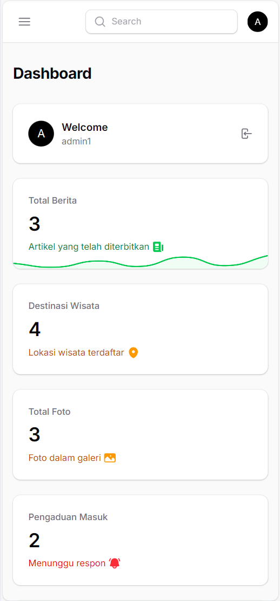
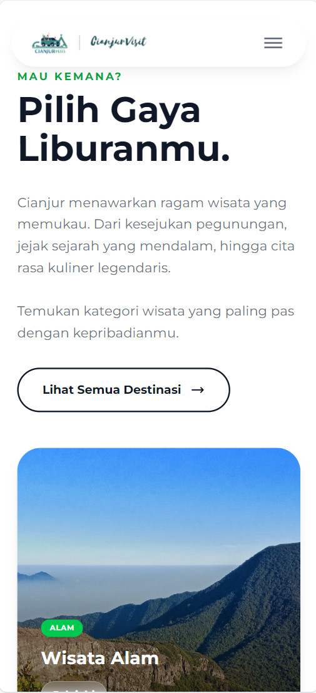

# 🏔️ Cianjur Visit - Jelajahi Keindahan Cianjur

 
> *Platform Informasi Pariwisata Resmi Kabupaten Cianjur*

[](https://laravel.com)
[](https://filamentphp.com)
[](https://tailwindcss.com)

## 📖 Tentang Projek

**Cianjur Visit** adalah sistem informasi pariwisata berbasis web yang dirancang untuk mempromosikan destinasi wisata, event budaya, dan berita terkini seputar Kabupaten Cianjur. Aplikasi ini menghubungkan wisatawan dengan informasi akurat yang dikelola langsung oleh Dinas Pariwisata melalui panel admin yang canggih.

Dibangun dengan **TALL Stack** (Tailwind, Alpine, Laravel, Livewire) dan menggunakan **FilamentPHP** sebagai Admin Panel super cepat.

---

## ✨ Fitur Unggulan

### 🌍 Halaman Publik (Frontend)
- **Desain Modern & Responsif:** Tampilan elegan dengan animasi halus menggunakan Tailwind CSS & Alpine.js.
- **Destinasi Wisata:** Katalog lengkap wisata alam, sejarah, dan kuliner.
- **Event & Festival:** Kalender kegiatan budaya dan pariwisata.
- **Galeri Foto:** Dokumentasi visual keindahan Cianjur.
- **Form Pengaduan:** Layanan interaktif bagi pengunjung untuk memberikan masukan.

### 🛡️ Admin Panel (Backend)
- **Filament Dashboard:** Dashboard admin yang powerfull dan mudah digunakan.
- **Role & Permission (Shield):** Manajemen hak akses user (Super Admin, Admin, Editor) yang aman.
- **Manajemen Konten (CRUD):** Kelola Destinasi, Event, Berita, dan Galeri dengan mudah.
- **Statistik Dashboard:** Grafik kunjungan dan ringkasan data real-time.

---

## 📸 Tangkapan Layar (Screenshots)

| Landing Page | Admin Dashboard |
| :---: | :---: |
|  |  |

| Manajemen Destinasi | Menu Mobile Modern |
| :---: | :---: |
|  |  |


---

- PHP >= 8.2
- Composer
- Node.js & NPM
- MySQL


**Clone Repository**
   ```bash
   git clone [https://github.com/username/cianjur-visit.git](https://github.com/username/cianjur-visit.git)
   cd cianjur-visit